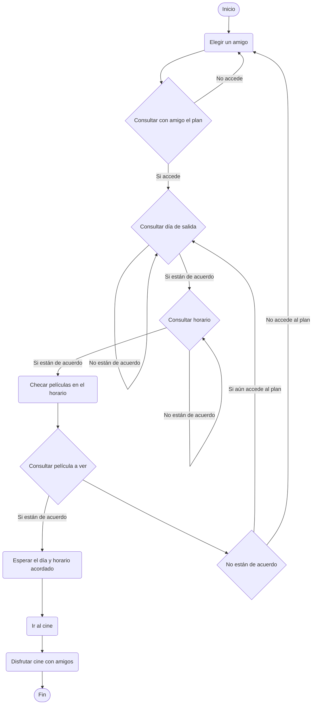

# Diagrama de Flujo: Ir al cine con amigos

```mermaid
flowchart TD
A([Inicio]) -->B(Elegir un amigo)
B --> C{Consultar con amigo el plan}
C -->|Si accede| D{Consultar día de salida}
C --> |No accede| B
D --> |Si están de acuerdo| E{Consultar horario}
D --> |No están de acuerdo|D
E --> |Si están de acuerdo|F(Checar películas en el horario)
E --> |No están de acuerdo|E
F --> G{Consultar película a ver}
G --> |Si están de acuerdo|H(Esperar el día y horario acordado)
G --> GA{No están de acuerdo}
GA --> |Si aún accede al plan|D
GA --> |No accede al plan|B
H --> I(Ir al cine)
I --> J(Disfrutar cine con amigos)
J --> K([Fin])
```
